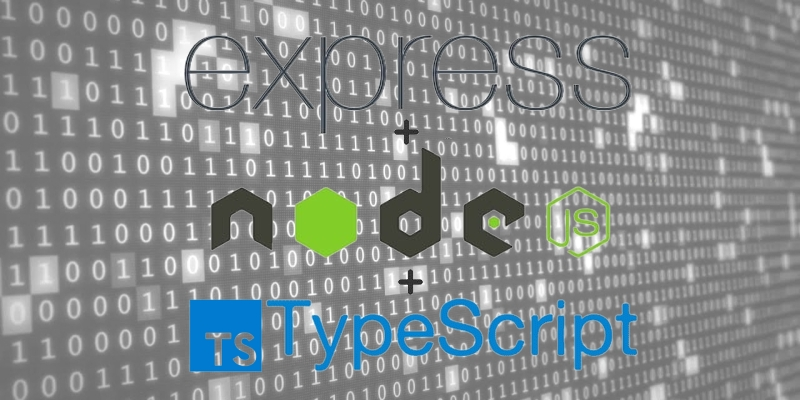

</br></br>

## REQUIREMENTS
- Node.js - Version 14 or above
- Typescript - Version 4.6.4 or above (installed globally)
- Ts-Node - Version 10.7.0 or above (installed globally)
 
</br></br>

## INITIALIZING THE PROJECT
### 1 - Create the project directory
```shell
$ mkdir docker-typescript-sample-web-app
$ cd docker-typescript-sample-web-app
```
</br>

### 2 - Initialize the project as a npm project:
```shell
$ npm init -y
```
From the command above, the `-y` flag indicates to `npm init` to automatically accept and apply the default settings. After this command completes you should have a [package.json](./package.json) file with content similar to the following:
```json
{
    "name": "docker-typescript-sample-web-app",
    "version": "1.0.0",
    "description": "- To get started, create a new folder called `node-express-app` and move into it:     ```shell     $ mkdir node-express-app; cd node-express-app     ```",
    "main": "index.js",
    "scripts": {
        "test": "echo \"Error: no test specified\" && exit 1"
    },
    "keywords": [],
    "author": "",
    "license": "ISC"
}
```
</br>

### 3 - Install and configure TypeScript in the project
```shell
$ npm install -D typescript
```
From the command above, the `-D` flag indicates to `npm install` to install TypeScript as a development dependency, which adds it to the devDependencies list at [package.json](./package.json). 

As a last step, it is required to configure TypeScript compiler options, and for this task we have to create a [tsconfig.json](./tsconfig.json) at the project's root path.
```shell
$ touch tsconfig.json # or tsc --init
```
For this sample project, we can configure with the following settings:
```json
{
  "compilerOptions": {
    "module": "commonjs", // indicates the module code generation method
    "esModuleInterop": true, // indicates to import CommonJS modules in compliance with ES6 modules spec
    "target": "es6", // indicates the output language level
    "moduleResolution": "node", // indicates the module resolution strategy. 'node' is for when using CommonJS implementation
    "sourceMap": true, // enables the generation of sourcemap files
    "outDir": "dist", // indicates the location to output .js files after transpilation
    "types": ["node"] // indicates to include in the global scope the listed packages. In this case all packages from 'node'
  },
  "lib": ["es2015"] // indicates what default set of type definitions for built-in JS APIs should be included by Typescript
}
```
Check [here](https://www.typescriptlang.org/docs/handbook/tsconfig-json.html) to know about all the possible options.
</br>

### 4 - Install and configure Express in the project
```shell
$ npm install express
$ npm install -D ts-node
$ npm install -D @types/node
$ npm install -D @types/express
```
The first command installs Express in the project and saves it in the dependencies list in the [package.json](./package.json) file. The second command installs a npm utility tool for running TypeScript directly from Node.js without precompilation. The third command installs the custom types for Node.js in typescript. And the last command installs the Express types for TypeScript support and saves it in the devDependencies list.

Notice that we could run the last three command as one, like `npm install -D ts-node @types/node @types/express`. But I chose to do as separate commands in order to promote a better understanding.

After install those development dependencies, add the following lines to the scripts section in the [package.json](./package.json) file:
```json
"dev": "ts-node app.ts",
"prd": "node dist/app.js",
"build": "tsc -p ."
```
From those entries, we can now execute the application in development mode by executing `npm run dev`. Or build the application for production with executing `npm run build`. And then run the application in production mode by executing `npm run prd`.

</br></br>

## IMPLEMENTING THE APPLICATION
We will create a [app.ts](./app.ts) file where we will define a very minimalistic web application using the [Express.js](https://expressjs.com/) framework. 
```shell
$ touch app.ts
```

And then paste the following lines in it:
```typescript
import express, { Response } from 'express';

const app = express();
const port = process.env.PORT || 8080;

app.get('/', (_, res: Response) => {
  res.send('🚀 Hello World from TypeScript 🚀');
});

app.listen(port, () => {
  console.log(`Application is listening at http://localhost:${port}`);
});
```
The application will start a server and listens on port 8080 for connections. And for requests to the root URL it will respond with "🚀 Hello World from TypeScript 🚀" as we will see next.

</br></br>

## TESTING THE APPLICATION
As mentioned earlier, to run our TypeScript application we will use [ts-node](https://www.npmjs.com/package/ts-node), which is an execution engine that allows us to run TypeScript files directly, without the need for precompilation, also known as transpilation.
```shell
$ npm run dev
```

Now, if we visit our browser at http://localhost:8080, we should get the message:
```
🚀 Hello World from TypeScript 🚀
```

Or from the shell using `curl localhost:8080` we should get a response like:
```shell
HTTP/1.1 200 OK
X-Powered-By: Express
Content-Type: text/html; charset=utf-8
Content-Length: 11
ETag: W/"b-Ck1VqNd45QIvq3AZd8XYQLvEhtA"
Date: Wed, 11 May 2022 18:48:51 GMT
Connection: keep-alive
Keep-Alive: timeout=5

🚀 Hello World from TypeScript 🚀
```

</br></br>

## DOCKERIZING THE APPLICATION
### 1 - Define the [Dockerfile](./Dockerfile)
```docker
# indicates the base image
FROM node:16-alpine

# creates inside the image a directory to hold the application code
WORKDIR /usr/src/app

# copies all files/directories from where docker build command is run into the path relative to WORKDIR
COPY . .

# based on package-lock.json, install only dependencies. devDependencies are ignored
RUN npm ci --only=production

# required dependencies so the application can have access to the global 'process' module from Node in production
RUN npm install -D @types/node

# installs Typescript globally in the container runtime system
RUN npm install -g typescript 

# compiles the project by transpiling TypeScript files (.ts) into JavaScript files (.js). The resulting .js files are put into the dist directory
RUN tsc -p .

# defines the application will be listening for requests on port 8080
EXPOSE 8080

# defines the command to run the application
CMD ["node", "dist/app.js"]
```
</br>


### 2 - Define the .dockerignore
To ensure only the required files are copied into the Docker image, create a file in the project root path called .dockerignore 
```shell
$ touch .dockerignore
```

And then paste the following lines in it:
```dockerignore
dist
Dockerfile
node_modules
README.md
```
</br>

### 3 - Build the application image
```shell
$ docker build -t docker-typescript-sample-web-app .
```
From the command above, the `-t` flag is used to tag the image as **docker-typescript-sample-web-app** so we can reference it later from command such as `docker images` or `docker run`, as we will see next. The `.` signals that the build context is the current working directory.

You should get an output like:
```shell
Sending build context to Docker daemon  52.74kB
Step 1/8 : FROM node:16-alpine
 ---> e5065cc78074
Step 2/8 : WORKDIR /usr/src/app
 ---> Using cache
 ---> 8d43833808df
Step 3/8 : COPY . .
 ---> Using cache
 ---> d6a6b90434e1
Step 4/8 : RUN npm ci --only=production
 ---> Using cache
 ---> 84860fe6df36
Step 5/8 : RUN npm install -g typescript
 ---> Using cache
 ---> 1b07230a4c7e
Step 6/8 : RUN tsc -p .
 ---> Using cache
 ---> 938956246909
Step 7/8 : EXPOSE 8080
 ---> Using cache
 ---> 3146353a373a
Step 8/8 : CMD ["node", "dist/app.js"]
 ---> Using cache
 ---> 674f760df5ec
Successfully built 674f760df5ec
Successfully tagged docker-typescript-sample-web-app:latest
```
</br>

### 4 - Run the application image
```shell
$ docker run --name docker-typescript-sample-web-app -p 8080:8080 -it --rm docker-typescript-sample-web-app
```
From the command above, the `--name` flag is used give a memorable name to the container. The `-p` flag is used to bind the container's exposed port on Dockerfile to the host. The `-it` flag is used to start the container in interactive mode, allowing us to interact with /bin/bash of the container. The `--rm` flag is used to automatically remove the container when it exits.

You should get an output like:
```shell
Express is listening at http://localhost:8080
```
</br>

### 5 - Stop the application image
```shell
$ docker kill docker-typescript-sample-web-app
```