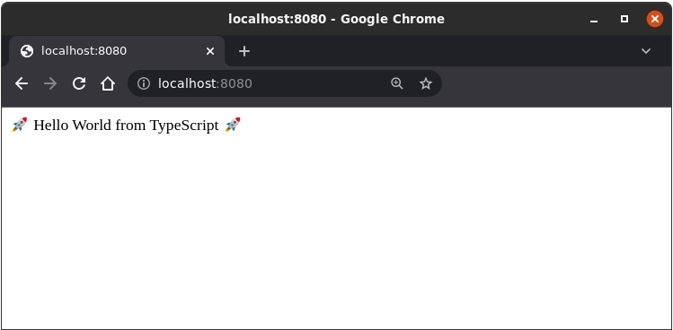

</br></br>

## REQUIREMENTS
- Node.js - Version 14 or above
- IDE - Visual Studio Code (recommended)
 
</br></br>

## INITIALIZING THE PROJECT
### 1 - Create the project directory
```shell
$ mkdir docker-typescript-sample-web-app
$ cd docker-typescript-sample-web-app
```
</br>

### 2 - Initialize the project as a npm project:
```shell
$ npm init -y
```
From the command above, the `-y` flag indicates to `npm init` to automatically accept and apply the default settings. After this command completes you should have a [package.json](./package.json) file with content similar to the following:
```json
{
    "name": "docker-typescript-sample-web-app",
    "version": "1.0.0",
    "description": "- To get started, create a new folder called `node-express-app` and move into it:     ```shell     $ mkdir node-express-app; cd node-express-app     ```",
    "main": "index.js",
    "scripts": {
        "test": "echo \"Error: no test specified\" && exit 1"
    },
    "keywords": [],
    "author": "",
    "license": "ISC"
}
```
</br>

### 3 - Install and configure TypeScript in the project
```shell
$ npm install -D typescript
```
From the command above, the `-D` flag indicates to `npm install` to install TypeScript as a development dependency, which adds it to the devDependencies list at [package.json](./package.json). 

As a last step, it is required to configure TypeScript compiler options, and for this task we have to create a [tsconfig.json](./tsconfig.json) at the project's root path.
```shell
$ touch tsconfig.json # or tsc --init
```
For this sample project, we need only to configure the following options:
```json
{
  "compilerOptions": {
    "module": "commonjs", 
    "esModuleInterop": true,
    "target": "es6",
    "moduleResolution": "node",
    "sourceMap": true,
    "outDir": "dist",
    "types": ["node"]
  },
  "lib": ["es2015"]
}
```
`"module": "commonjs"` - Indicates which module code generation method should to use.<br>
`"esModuleInterop": true` - Indicates to import CommonJS modules in compliance with ES6 modules spec.<br>
`"target": "es6"` - Indicates the output language level.<br>
`"moduleResolution": "node"` - Indicates the module resolution strategy. `node` is for when using `commonjs` implementation.<br>
`"sourceMap": true` - Enables the generation of sourcemap files.<br>
`"outDir": "dist"` - Indicates the location to output .js files after transpilation.<br>
`"types": ["node"]` - Indicates to include in the global scope the listed packages. In this case all packages from 'node'.<br>
`"lib": ["es2015"]` - Indicates what default set of type definitions for built-in JS APIs should be included by Typescript.<br>
Check [here](https://www.typescriptlang.org/docs/handbook/tsconfig-json.html) to know about all other the possible options.
</br>

### 4 - Install and configure Express.js in the project
```shell
$ npm install express
$ npm install -D ts-node
$ npm install -D @types/node
$ npm install -D @types/express
```
`npm install express` - This command installs Express.js in the project.<br>
`npm install -D ts-node` - This command installs Ts-Node in the project so we can run our TypeScript code directly from Node without precompilation.<br>
`npm install -D @types/node` - This command installs custom types for Node in Typescript.<br>
`npm install -D @types/express` - This command installs the Express.js types for TypeScript's support.

The last three installed dependencies were saved it in the devDependency list section in the [package.json](./package.json). Moreover those commands could be executed as one, `npm install -D ts-node @types/node @types/express`.

After installing all these libraries, add the following lines to the scripts section in the [package.json](./package.json):
```json
"dev": "ts-node app.ts",
"prd": "node dist/app.js",
"build": "tsc -p ."
```
From those entries, we can now execute the application in development mode by executing `npm run dev`. Or build the application for production with executing `npm run build`. And then run the application in production mode by executing `npm run prd`.

</br></br>

## IMPLEMENTING THE APPLICATION
We will create a [app.ts](./app.ts) file where we will define a very simple Web application using the [Express.js](https://Express.js.com/) framework.
```shell
$ touch app.ts
```

Open the file and pastes the following lines:
```typescript
import express, { Response } from 'express';

const app = express();
const port = process.env.PORT || 8080;

app.get('/', (_, res: Response) => {
  res.send('🚀 Hello World from TypeScript 🚀');
});

app.listen(port, () => {
  console.log(`Application is listening at http://localhost:${port}`);
});
```
The application will start a server and listens on port 8080 for connections. And for any requests to the root URL it will respond with "🚀 Hello World from TypeScript 🚀" as we will see next.

</br></br>

## TESTING THE APPLICATION
As mentioned earlier, to run our TypeScript application we will use [ts-node](https://www.npmjs.com/package/ts-node), which is an execution engine that allows us to run TypeScript files directly, without the need for precompilation/transpilation to Javascript.
```shell
$ npm run dev
```

Now, if we visit your browser at http://localhost:8080, you should get:

<br>

Or from the shell using `curl` you should get the same message:
```shell
$ curl localhost:8080

🚀 Hello World from TypeScript 🚀
```
</br></br>

## DOCKERIZING THE APPLICATION
### 1 - Define the Dockerfile
The [Dockerfile](./Dockerfile) is what we use to configure and build our Docker image. It is through it that we will define which components will be used in the composition of our container, as well as other requirements at the operating system level that our project needs.
```docker
FROM node:16-alpine

WORKDIR /usr/src/app

COPY . .

RUN npm ci --only=production

RUN npm install -D @types/node

RUN npm install -g typescript 

RUN tsc -p .

EXPOSE 8080

CMD ["node", "dist/app.js"]
```
`FROM node:16-alpine` - Indicates the base image of our container.
`WORKDIR /usr/src/app` - Creates a directory to hold the application code in the container's file system.
`COPY . .` - Copies all files and directories from where `docker build` command is ran into the path relative to WORKDIR
`RUN npm ci --only=production` - Based on [package-lock.json](./package-lock.json) install only dependencies. devDependencies are ignored
`RUN npm install -D @types/node` - Installs `types/node` as devDependency so that our application can have access to the global 'process' module from Node in production.
`RUN npm install -g typescript` - Installs Typescript globally in the container runtime system so we can have access to `tsc`, the Typescript cli compiler.
`RUN tsc -p .` - Compiles the project by transpiling TypeScript files (.ts) into JavaScript files (.js). The resulting .js files are put into the dist directory
`EXPOSE 8080` - Defines that the application will be listening for requests at 8080 port.
`CMD ["node", "dist/app.js"]` - Defines the command to run the application
</br>


### 2 - Define the .dockerignore
To ensure only the required files are copied into the Docker image, create a file in the project root path called [.dockerignore](./.dockerignore). The .dockerignore allows us to mention a list of files and/or directories which we want be ignored while building our image. This would definitely reduce the size of the image and also help to speed up the docker build process.
```shell
$ touch .dockerignore
```

And then paste the following lines in it:
```dockerignore
dist
Dockerfile
node_modules
README.md
```
</br>

### 3 - Build the application image
```shell
$ docker build -t docker-typescript-sample-web-app .
```
From the command above, the `-t` flag is used to tag the image as **docker-typescript-sample-web-app** so we can reference it later from command such as `docker images` or `docker run`, as we will see next. The `.` signals that the build context is the current working directory.

You should get an output like:
```shell
Sending build context to Docker daemon  52.74kB
Step 1/8 : FROM node:16-alpine
 ---> e5065cc78074
Step 2/8 : WORKDIR /usr/src/app
 ---> Using cache
 ---> 8d43833808df
Step 3/8 : COPY . .
 ---> Using cache
 ---> d6a6b90434e1
Step 4/8 : RUN npm ci --only=production
 ---> Using cache
 ---> 84860fe6df36
Step 5/8 : RUN npm install -g typescript
 ---> Using cache
 ---> 1b07230a4c7e
Step 6/8 : RUN tsc -p .
 ---> Using cache
 ---> 938956246909
Step 7/8 : EXPOSE 8080
 ---> Using cache
 ---> 3146353a373a
Step 8/8 : CMD ["node", "dist/app.js"]
 ---> Using cache
 ---> 674f760df5ec
Successfully built 674f760df5ec
Successfully tagged docker-typescript-sample-web-app:latest
```
</br>

### 4 - Run the application image
```shell
$ docker run --name docker-typescript-sample-web-app -p 8080:8080 -it --rm docker-typescript-sample-web-app
```
From the command above, the `--name` flag is used give a memorable name to the container. The `-p` flag is used to bind the container's exposed port on Dockerfile to the host. The `-it` flag is used to start the container in interactive mode, allowing us to interact with /bin/bash of the container. The `--rm` flag is used to automatically remove the container when it exits.

You should get an output like:
```shell
Express is listening at http://localhost:8080
```
</br>

### 5 - Stop the application image
```shell
$ docker kill docker-typescript-sample-web-app
```